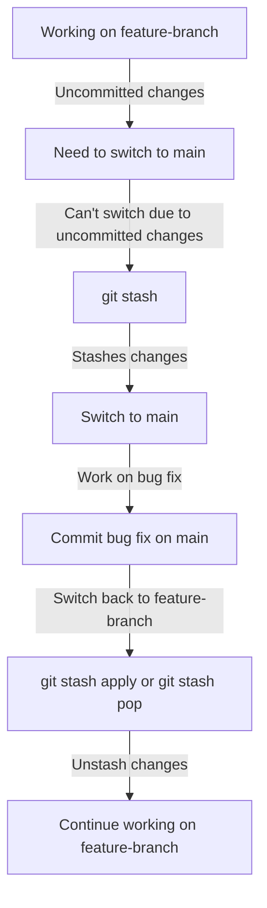
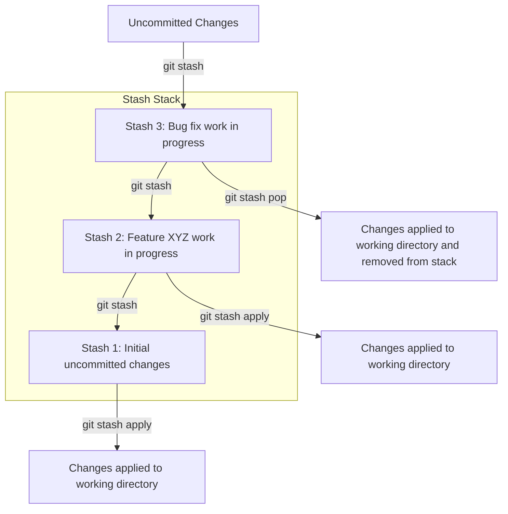

# Git Stash: A Comprehensive Guide for DevOps Engineers

## 1. Introduction to Git Stash

### What is Git Stash?
- Git Stash allows you to temporarily save changes without committing them.
- Imagine you're painting a wall, but you need to stop and clean up without losing your progress. Git Stash helps you do this with your code.

### Why use Git Stash?
- Helps when you want to switch branches but have uncommitted changes.

- Useful for experimenting without affecting the current state of the code.

### How does it work?
- Stashes changes in a stack-like structure, allowing you to apply them later.


## 2. Basic Git Stash Commands

### Stashing Changes: `git stash`
- Saves your working directory and index state, and cleans your working directory.
- Example:
  ```bash
  git stash
  ```
- Imagine you’re playing with building blocks and need to keep them aside quickly. Git Stash lets you put them in a safe box.

### Applying Stashed Changes: `git stash apply`
- Re-applies the most recent stash to your working directory.
- Example:
  ```bash
  git stash apply
  ```
- Think of taking those blocks back out of the box and continuing to build.

### Listing Stashed Changes: `git stash list`
- Shows a list of all stashed changes.
- Example:
  ```bash
  git stash list
  ```
- Like looking inside the box to see all the items you've stored away.

### Dropping a Stash: `git stash drop`
- Deletes a specific stash from your list.
- Example:
  ```bash
  git stash drop stash@{0}
  ```
- Removing one specific toy from the box permanently.

    ```mermaid
    graph TD;
      A[Stash 1] -->|Drop| B[Removed];
    ```


### Popping a Stash: `git stash pop`
- Applies the most recent stash and removes it from the stash list.
- Example:
  ```bash
  git stash pop
  ```
- Taking the blocks out of the box and throwing the box away.

### Stashing Untracked Files: `git stash -u`
- Includes untracked files in the stash.
- Example:
  ```bash
  git stash -u
  ```
- Saving both your toys and any new blocks you’ve found.

### Stashing All Files Including Ignored Ones: `git stash -a`
- Stashes untracked files and ignored files.
- Example:
  ```bash
  git stash -a
  ```
- Putting all toys, even those normally left on the floor, into the box.

## 3. Advanced Git Stash Operations

### Stashing Specific Changes: `git stash push -p`
- Allows you to interactively select specific changes to stash.
- Example:
  ```bash
  git stash push -p
  ```
- Imagine you have multiple toys, and you only want to put some of them in the box.

### Creating a Branch from a Stash: `git stash branch <branch_name>`
- Creates a new branch and applies the stash to it.
- Example:
  ```bash
  git stash branch new-feature
  ```
- Creating a new play area (branch) where you can work on the saved blocks (stash).

### Applying Stash to Different Branch: `git stash apply <stash_name>`
- Apply a specific stash to a different branch.
- Example:
  ```bash
  git stash apply stash@{1}
  ```
- Moving your blocks to a different play area.

### Showing Stash Details: `git stash show -p <stash_name>`
- Shows the details of what’s inside a stash.
- Example:
  ```bash
  git stash show -p stash@{0}
  ```
- Looking at what’s in a specific box without taking everything out.

### Saving a Stash with a Message: `git stash save "message"`
- Saves the stash with a descriptive message.
- Example:
  ```bash
  git stash save "Work on Login Feature"
  ```
- Labeling your toy box so you know exactly what’s inside.

### Applying Stash Without Removing It: `git stash apply`
- Applies the stash without removing it from the stash list.
- Example:
  ```bash
  git stash apply
  ```
- Taking the toys out but leaving the box intact in case you want to use it later.

### Viewing the Stash Index: `git stash list`
- Lists all stashes, including their index and any messages attached to them.
- Example:
  ```bash
  git stash list
  ```
- Checking all your labeled toy boxes to see what’s inside each one.

### Creating a Stash Patch: `git stash show -p`
- Shows the stash as a patch, detailing the exact changes.
- Example:
  ```bash
  git stash show -p
  ```
- Viewing detailed instructions on how your toys were arranged in the box.

## 4. Managing Multiple Stashes

### Applying a Specific Stash: `git stash apply stash@{index}`
- Apply a specific stash from your list.
- Example:
  ```bash
  git stash apply stash@{2}
  ```
- Choosing a specific box of toys to open and play with.

### Dropping a Specific Stash: `git stash drop stash@{index}`
- Remove a specific stash from the list.
- Example:
  ```bash
  git stash drop stash@{1}
  ```
- Throwing away a specific toy box that you no longer need.

### Clearing All Stashes: `git stash clear`
- Removes all stashes from the list.
- Example:
  ```bash
  git stash clear
  ```
- Throwing away all your toy boxes in one go.

### Renaming Stashes (Manual Method)
- While Git does not natively support renaming stashes, you can manually create a new stash with the desired name and drop the old one.
- Example:
  ```bash
  git stash apply stash@{0}
  git stash save "New Stash Name"
  git stash drop stash@{0}
  ```
- Relabeling a toy box by transferring the toys to a new box with the correct label.

## 5. Best Practices for Using Git Stash

### When to Use Git Stash
- Use when you need to quickly save work in progress.
- Ideal when switching between branches.

### Avoiding Stash Overuse
- Don't use Git Stash as a substitute for committing regularly.
- Remember to clean up old stashes to avoid clutter.

### Combining Git Stash with Other Git Commands
- Use with `git rebase` and `git merge` for smoother workflows.

## 6. Troubleshooting Common Git Stash Issues

### Conflict Resolution
- How to resolve conflicts when applying stashes.
- Example:
  ```bash
  git stash apply stash@{1}
  ```
- If there’s a conflict, Git will show a message, and you’ll need to resolve it like a merge conflict.
- Git will mark the conflict areas in the files, and you need to manually choose which changes to keep.

### Stash Lost and Recovery
- What to do if you accidentally drop a stash.
- You can recover a lost stash if you have the stash ID.
- Example:
  ```bash
  git fsck --lost-found
  ```
- This command will search for dangling commits, which might include your lost stash.
- Use `git stash apply` with the found stash ID to recover it.

### Stashing with Pathspec
- Stashing only specific files or directories.
- Example:
  ```bash
  git stash push path/to/file
  ```
- Saving only a subset of your toys in the box.

## Conclusion

### Summary of Key Takeaways
- Git Stash is a powerful tool for managing uncommitted changes.
- It allows you to save and manage temporary changes without committing them.
- Stashing is stack-based, meaning you can have multiple stashes and manage them easily.

### Encouragement to Experiment
- Experiment with the commands in your own projects to get comfortable with Git Stash.
- Try different scenarios, like stashing specific changes, applying stashes to different branches, and recovering lost stashes.
- Remember that while Git Stash is handy, it should complement, not replace, your regular commit workflow.

### Additional Resources
- [Git Documentation on Stashing](https://git-scm.com/docs/git-stash)
- [Interactive Git Tutorial](https://try.github.io)
- [Pro Git Book - Chapter on Stashing and Cleaning](https://git-scm.com/book/en/v2/Git-Tools-Stashing-and-Cleaning)

---

### Presentation Notes
- Use visuals like toy boxes and building blocks to represent stashes and code changes.
- Include live demos or interactive exercises where participants can practice using the `git stash` commands.
- Encourage questions and discussions about different use cases for Git Stash in real-world DevOps scenarios.

---

**End of Presentation**
